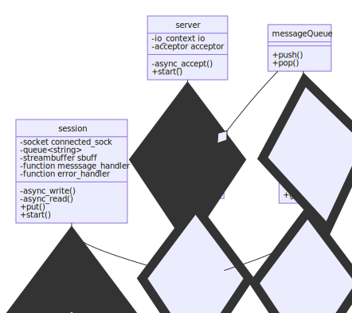

# Simple chat application example.


## Motivation
This code is not meant to be used in a production environment and is mainly written
for personal educational purposes. As such, the build pipe-line and dev environment
is likely an overkill for the size of the current project, but can serve as a starting template for larger projects with similar aim.

## Server
### Functionality
* Each server should have an instance of a chat room
* The chat room should contain all to current active participants, which are a type of active sessions.
* The server should promt and store the name of each participant when creating a new session.
* When broadcasting a chat messages, the name of the owner of the message should be printed first.


**Quick overview of current build:**




## Client
At the current stage, there is no client build; use the netcat tool to test and connect to the chat server.


## Usage
### Development
The environment contains a .devcontainer folder which contains the configurations to develop the app inside a docker container instance using vscode.

Make sure the [Remote container](https://marketplace.visualstudio.com/items?itemName=ms-vscode-remote.remote-containers) extensions is installed and press CTRL+SHIFT+P.
This opens the vscode command window. Enter 
```vscode
>Remote-Containers: Reopen in container
```
This creates a development container instance with a stand alone boost library based on the 
image [Dockerfile](Dockerfile). You can add more configurations for the dev container in the 
.devcontainer file. See: [Developing inside a container](https://code.visualstudio.com/docs/remote/container) for more information on how to do this.

Run the ``./cbuild`` command in a terminal to start a clean build or use vscode or other ide 
extension to run and debug the build.